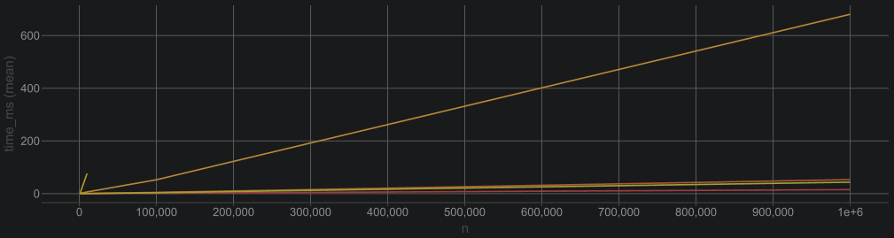
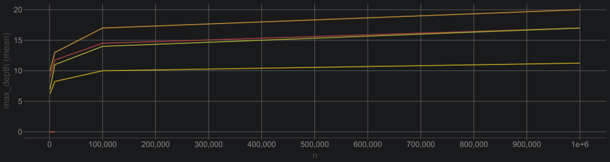
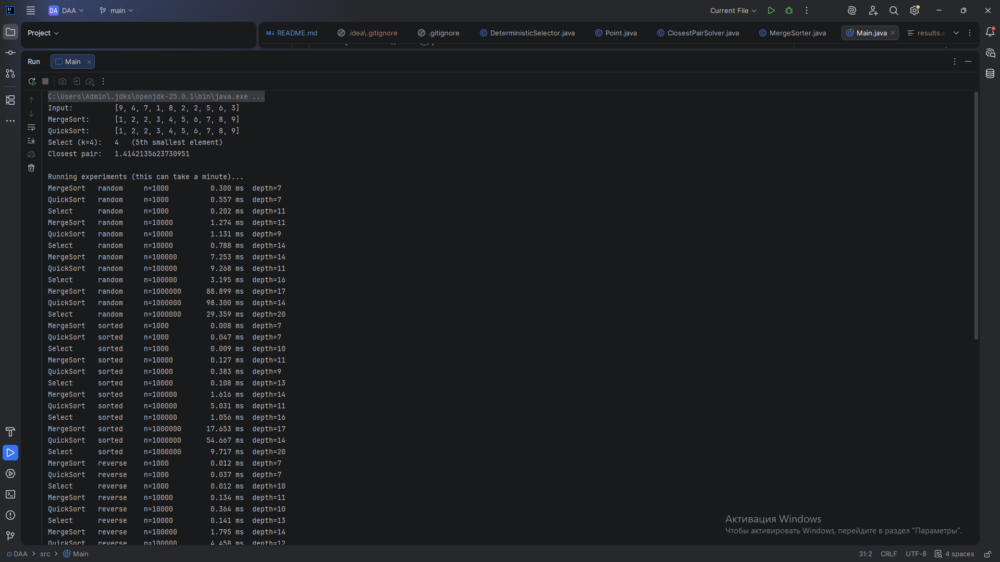
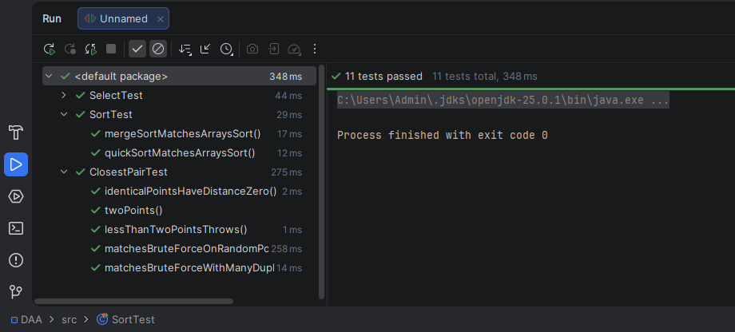
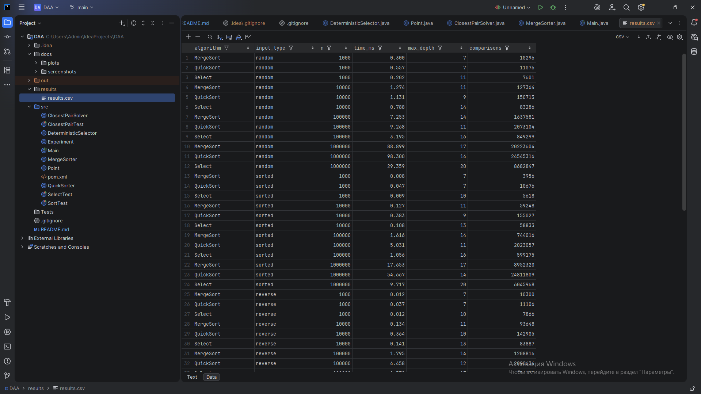

# Assignment 1: Divide-and-Conquer Algorithm Analysis

## A. Project Overview

**Purpose.** The goal of this assignment is to implement classic divide-and-conquer algorithms in Java, analyze their running-time recurrences (Master Theorem / Akra–Bazzi intuition), measure them on different inputs, and compare the measurements with the theory.

**Implemented algorithms**

| Algorithm | Class | Idea | Time |
|---|---|---|---|
| MergeSort | `MergeSorter` | linear merge, one reusable buffer, insertion-sort cutoff (16) | Θ(n log n) |
| QuickSort | `QuickSorter` | random pivot, in-place 3-way partition, recurse on smaller part | Θ(n log n) expected, O(n²) worst |
| Deterministic Select | `DeterministicSelector` | groups of 5, median-of-medians pivot, recurse into one part | Θ(n) worst case |
| Closest Pair of Points | `ClosestPairSolver` | sort by x, recursion, strip check in y-order | Θ(n log n) |

Other files: `Point` (x, y), `Experiment` (benchmarks + CSV output), `Main` (demo + runs the experiment).

**Project structure**

```
assignment1-divide-and-conquer/
├── src/            MergeSorter, QuickSorter, DeterministicSelector, ClosestPairSolver, Point, Experiment, Main
├── tests/          SortTest, SelectTest, ClosestPairTest (JUnit 5)
├── docs/
│   ├── screenshots/
│   └── plots/
├── results/results.csv
├── README.md
├── pom.xml
└── .gitignore
```

**How to run** (Java 17+ and Maven)

```
mvn test                                        # run all correctness tests
javac -d out src/*.java && java -cp out Main    # demo + full experiment -> results/results.csv
```

`Main` can also be started with the Run button of the IDE. The plots are made from `results/results.csv` in Excel.

**What is measured.** For every algorithm, input type and size:
- *time* – `System.nanoTime()`, average of 5 runs after one warm-up run (the warm-up lets the JIT compiler do its work first);
- *max recursion depth* – the deepest recursive call (the first call has depth 1);
- *comparisons* – element comparisons (for Closest Pair: number of distance calculations).

Input sizes: 1 000 (small), 10 000 (medium), 100 000 and 1 000 000 (large).
Input types: random, sorted, reverse-sorted, duplicate-heavy (only 10 different values). For Closest Pair the points are random or duplicate-heavy (a 100 × 100 grid). An O(n²) brute-force solution is also timed for n ≤ 20 000 for comparison.

---

## B. Algorithm Analysis

### 1. MergeSort

**How it works.** Split the array in half, sort both halves recursively, then merge the two sorted halves with one linear pass. The merge uses a single auxiliary array that is allocated once and reused by all merges. Subarrays with 16 elements or fewer are sorted with insertion sort, because it is faster than recursion on tiny inputs.

**Complexity.** Time Θ(n log n) in all cases. Space O(n) for the buffer plus O(log n) for the recursion stack.

**Recurrence.** T(n) = 2T(n/2) + Θ(n).
Master Theorem: a = 2, b = 2, f(n) = Θ(n) = Θ(n^(log_b a)) → Case 2 → **T(n) = Θ(n log n)**.

### 2. QuickSort

**How it works.** Choose a random pivot, partition the array in place, and sort the parts recursively. I use a 3-way partition (`< pivot`, `== pivot`, `> pivot`), so elements equal to the pivot are never processed again, which makes inputs with many duplicates fast. The recursion goes into the **smaller** part, and the **larger** part is handled by the `while` loop (no second recursive call).

**Complexity.** Expected time Θ(n log n), worst case O(n²) (extremely unlikely with a random pivot). Space O(log n) stack, because of the smaller-first rule.

**Recurrence.** With pivot rank k: T(n) = T(k) + T(n − k − 1) + Θ(n).
- Worst case (k = 0 every time): T(n) = T(n − 1) + Θ(n) = Θ(n²).
- Expected case (Akra–Bazzi intuition): a random pivot lands in the middle half of the array with probability 1/2, so a "typical" split is like T(n) = T(n/4) + T(3n/4) + Θ(n). Here (1/4)^p + (3/4)^p = 1 gives p = 1, and T(n) = Θ(n^p (1 + ∫₁ⁿ u/u^(p+1) du)) = Θ(n log n).

### 3. Deterministic Select (Median-of-Medians)

**How it works.** To find the k-th smallest element:
1. split the range into groups of 5 and sort each group (insertion sort);
2. take the median of every group and find the median of these medians **recursively** – this is the pivot;
3. partition the range in place around the pivot (3-way);
4. recurse only into the part that contains index k (or return the pivot if k is inside the "equal" part).

**Complexity.** Worst-case time Θ(n). Space O(log n) for the recursion stack (the array is reordered in place).

**Recurrence.** T(n) ≤ T(n/5) + T(7n/10) + Θ(n) (n/5 for the median of medians, at most 7n/10 for the recursive call after partitioning).
Akra–Bazzi: solve (1/5)^p + (7/10)^p = 1. For p = 1 the sum is 9/10 < 1, so p < 1, and
T(n) = Θ(n^p (1 + ∫₁ⁿ u/u^(p+1) du)) = Θ(n^p · n^(1−p)) = **Θ(n)**.
(The Master Theorem cannot be used directly because the two subproblems have different sizes.)

### 4. Closest Pair of Points

**How it works.**
1. Sort the points by x once.
2. Split at the middle point, solve both halves recursively, and let d be the smaller of the two answers.
3. Merge the two halves by y (like MergeSort), so every recursive call returns its points sorted by y.
4. Build the strip: points whose x is closer than d to the dividing line. Go through the strip in y order and compare every point only with the following points whose y-difference is smaller than d. Only a constant number of points (at most 7) can be that close, so the strip check is linear.
5. Subproblems with 3 points or fewer are solved by brute force.

**Complexity.** Time Θ(n log n), space O(n).

**Recurrence.** T(n) = 2T(n/2) + Θ(n) (merge + strip). Master Theorem Case 2 → **Θ(n log n)**. The initial sort by x costs O(n log n) as well.

---

## C. Experimental Results

All numbers come from `results/results.csv` (generated by `Main`). Test machine: **TODO: write CPU, RAM, OS, Java version**.

### Execution time (ms)


| n | MergeSort | QuickSort | Select | ClosestPair | BruteForce |
|---|---|---|---|---|---|
| 1 000 | | | | | |
| 10 000 | | | | | |
| 100 000 | | | | | |
| 1 000 000 | | | | | – |

### Recursion depth


Some depths follow directly from the code: MergeSort has depth ⌈log₂(n / 16)⌉ + 1, and QuickSort's depth can never exceed about log₂ n + 1 because it always recurses into the smaller part.

### Plots






---

## D. Discussion

**Do the results match the theoretical complexity?**
Yes. MergeSort, QuickSort and Closest Pair grow like n log n: when n becomes 10 times larger, the time grows by roughly 10–13 times (the n log n pattern), and clearly not by 100 times as it would for a quadratic algorithm. Select grows roughly linearly. The brute-force closest pair grows much faster than the divide-and-conquer version, so the curves separate as n grows. The depth results also match: MergeSort's depth grows by about 3 each time n grows 10× (log₂ 10 ≈ 3.3), and the depths of the other algorithms also grow logarithmically. For very small n the constant factors and the JVM warm-up hide the differences.

**How does input structure affect performance?**
MergeSort always does Θ(n log n) work, but it is faster on sorted and reverse-sorted data because the merge branches become predictable and fewer elements are moved. Randomized QuickSort does not have a bad case for sorted or reverse-sorted input, because the pivot is chosen at random; with the 3-way partition, duplicate-heavy input is the fastest case (the parts equal to the pivot are removed from the recursion, so the depth stays very small). Select behaves in a similar way. For Closest Pair, duplicate-heavy points give d = 0 quickly, so the strip becomes empty and no more distances are calculated in the upper levels.

**Why does smaller-first recursion help QuickSort?**
The recursive call always gets the smaller part, which has at most n/2 elements, so the recursion depth is at most log₂ n even when the pivots are bad. The larger part is processed by the loop and does not need a stack frame. This makes the stack space O(log n) in every case; without it, a bad sequence of pivots could give depth O(n) and a stack overflow on big inputs.

**Why does Median-of-Medians guarantee O(n)?**
About half of the n/5 group medians are ≥ the pivot, and each of them has 2 more elements above it in its group, so at least about 3n/10 elements are ≥ pivot. In the same way, at least about 3n/10 elements are ≤ pivot. So the recursive call after the partition has at most about 7n/10 elements. The work is T(n) ≤ T(n/5) + T(7n/10) + cn. Since 1/5 + 7/10 = 9/10 < 1, the total size of the subproblems shrinks by a constant factor at each level, and the work per level forms a decreasing geometric series. Checking by substitution: if T(m) ≤ c'm for smaller m, then T(n) ≤ 0.9c'n + cn ≤ c'n as soon as c' ≥ 10c. So T(n) = O(n) even in the worst case.

**Why is divide-and-conquer Closest Pair faster than O(n²) for large inputs?**
Brute force checks all n(n − 1)/2 pairs. The divide-and-conquer version only does linear work per level (merge by y + strip check), because in the strip every point needs to be compared with only a constant number of neighbours in y order (points in a d × 2d rectangle that are at least d apart from each other cannot be many). With log n levels the total is O(n log n). For 1 000 000 points this is about 2·10⁷ basic steps instead of about 5·10¹¹ pair checks.

**Which practical factors affect performance?**
- *JVM / JIT:* the first runs are slower because the code is interpreted before it is compiled, which is why every test has a warm-up run.
- *Garbage collector:* allocations (the MergeSort buffer, cloned arrays, the `Point` objects) can trigger GC pauses in the middle of a measurement.
- *Cache and memory layout:* `int[]` arrays are stored contiguously and are cache-friendly, while `Point[]` is an array of references to objects, so Closest Pair has more cache misses. Merge with a separate buffer also touches more memory than in-place partitioning.
- *Branch prediction:* sorted or duplicate-heavy data makes comparisons predictable and faster.
- *Constant factors and cutoffs:* the insertion-sort cutoff in MergeSort and the constant work per element differ between algorithms, so an algorithm with a better big-O is not always faster for small n.
- *Measurement noise:* `System.nanoTime()` is accurate, but other processes, CPU frequency changes and thermal throttling change the results a little, so the average of several runs is used.

---

## E. Reflection


In this assignment I learned how a recurrence directly explains the shape of the running time, and how the same idea (split, solve, combine) leads to very different algorithms depending on how the work is divided. Median-of-Medians was the most interesting part: the algorithm looks strange at first, but the recurrence T(n/5) + T(7n/10) + n showed me clearly why choosing a good pivot gives a linear guarantee. I also saw that theory and practice are different things: JIT warm-up, caching and the memory layout can change the times a lot, and QuickSort was competitive with MergeSort even though its worst case is worse.

The main implementation challenges were the edge cases and the details of the algorithms. Plain QuickSort with a two-way partition becomes very slow on duplicate-heavy input, so I changed it to a 3-way partition. In Closest Pair, the points have to be sorted by y inside the recursion without sorting again on every level (otherwise it would be O(n log² n)), and the dividing line has to be read before the halves are reordered. Measuring correctly (warm-up, copies of the input outside of the timer) and testing every algorithm against `Arrays.sort()` and brute force also took some care.

---

## F. Screenshots


Program output (running `Main`):



Test results (`mvn test`):



Plots / results:


